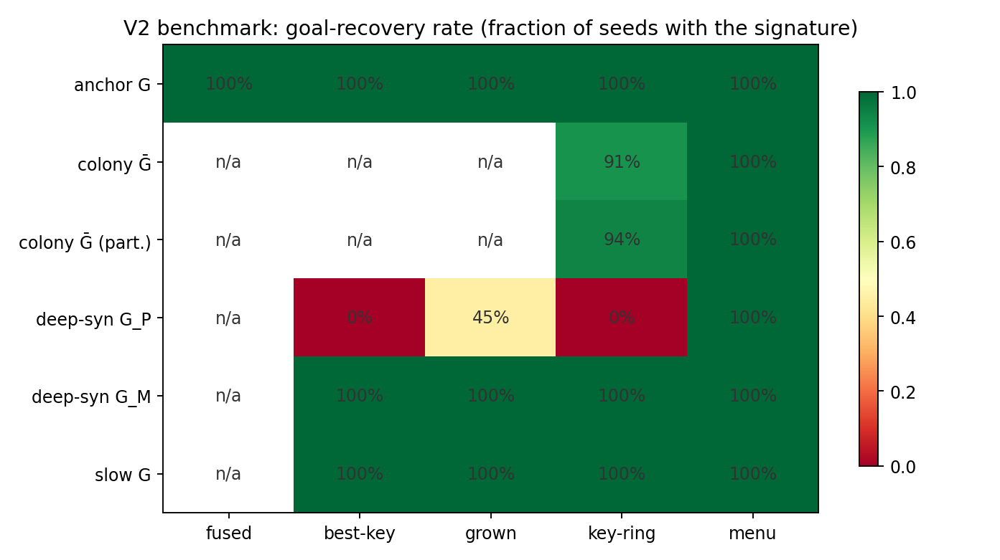

# value-detect — Unsupervised Value Discovery (v1–v3)

Locating agents **value structures**, the parts of their information structure that correspond to their goals, objectives, desires, or utility functions, from passive observation by their
empowerment–plasticity asymmetry: values are the components that most strongly drive
the world while being least driven by it. Extends Gunnar Zarncke's
[Unsupervised Agent Discovery](https://github.com/GunnarZarncke/agency-detect) one level
inward — from finding *agents* to finding *their drivers*.

This repository is the **complete, stable record of the first experiment class (v1–v3)**:
three pre-registered experiments on planted-structure worlds built on the UAD handle
benchmark, the instrument they validated, and the paper draft that writes them up. A
live successor, [`deployment-pipeline-value-detect`](https://github.com/SJ-Beard/deployment-pipeline-value-detect),
builds on this package to run the instrument on the deployment-pipeline simulator.

**Start here:** [`paper/value_discovery.tex`](paper/) (arXiv-style write-up of v1–v3) ·
per-experiment memos [`docs/WRITEUP_V1.md`](docs/WRITEUP_V1.md) (v1),
[`docs/WRITEUP_V2.md`](docs/WRITEUP_V2.md) (v2),
[`docs/WRITEUP_V3.md`](docs/WRITEUP_V3.md) (v3) ·
governing glossary [`docs/DEFINITIONS.md`](docs/DEFINITIONS.md) · dated decisions log
[`docs/DECISIONS.md`](docs/DECISIONS.md).

## The three experiments in one table

| | Question | Headline |
|---|---|---|
| **v1** | Does the *value signature* recover a planted goal? | Yes — uniquely, in every convention that sees through the world's XOR composition; naive pairwise fails structurally |
| **v2** | Which measurement conventions survive more complex worlds (incl. a 49-variable colony)? | Only the block-level **fused-agents any-block** convention recovers every planted goal; all variable-level conventions hit a scale wall (caught by a control) |
| **v3** | Can the instrument be fooled? | Fast captured goal refused; **slow captured goal defeats lag-1 passivity** (registered); noiseless twin indistinguishable; an interventional yardstick resolves exactly those two cases |



## Layout

| Item | Role |
|------|------|
| `value_detect/` | The package: worlds, directed-information estimators, scoring conventions, floors, criteria, block machinery, yardstick; 44 unit tests; runners for every chunk |
| `docs/` | Write-ups, experiment-log entries in the agency-detect format (V1–V3; the V3 entry is inserted into Gunnar's log as E21), locked pre-registrations, options memos, glossary, decisions log, session summaries, figures |
| `results/` | All artifacts by experiment stage (`chunk2–5` = v1; `v2_*`; `v3_*`), incl. verdict tables and investigation appendices |
| `paper/` | The LaTeX paper draft (+ bib, figures) — currently AI generated, not submitted |
| `setup_env.command` | One-shot environment (Python 3.9+; needs an adjacent [agency-detect](https://github.com/GunnarZarncke/agency-detect) checkout, imported in place and never modified) |

## Install & reproduce

```bash
git clone https://github.com/GunnarZarncke/agency-detect       # Gunnar's UAD (read-only dependency)
git clone https://github.com/SJ-Beard/value-detect
cd value-detect && ./setup_env.command ../agency-detect         # or omit the path if adjacent & named agency-detect-master
~/.venvs/value-detect/bin/python -m pytest value_detect/tests -q  # 44 tests
```

Runners for each experiment are in `value_detect/scripts/` (`chunk*_*.py` = v1,
`v2_*.py`, `v3_*.py`); each write-up lists its exact commands and runtimes. Fixed seeds
throughout; scripts touching the older agency-detect simulator pin `PYTHONHASHSEED=0`
(its traces are only cross-process reproducible with the hash seed pinned).

## Authorship & status

SJ Beard conceived the hypothesis and framing and made every design decision;
Claude (Anthropic) wrote the code, ran the experiments and drafted the documents under
SJ's direction. Every decision, deviation and defect is dated in `docs/DECISIONS.md`.
Research code; not a package release. See `LICENSE`.
